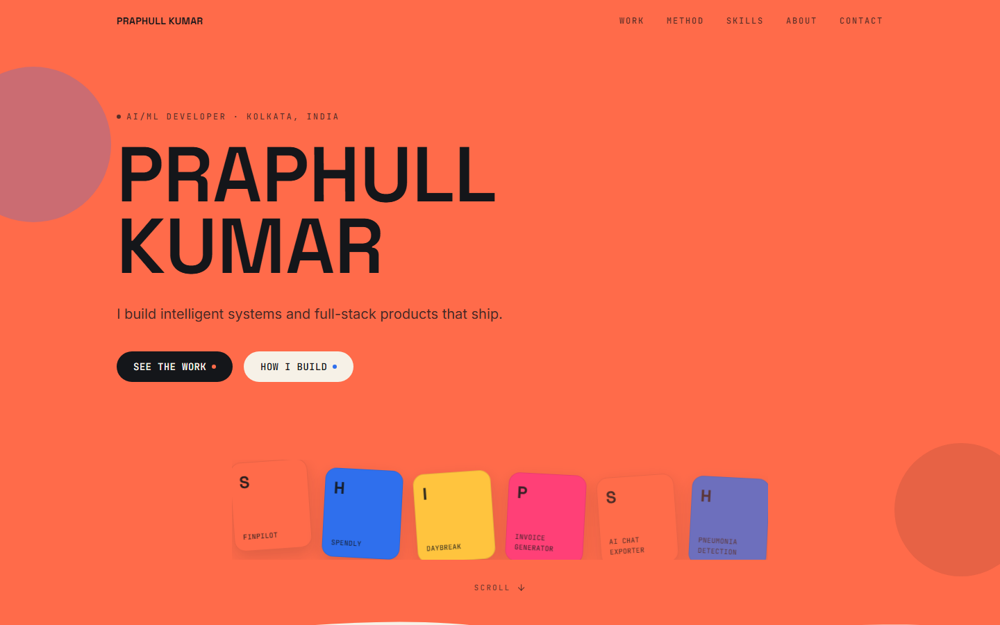

<p align="center">
  
</p>

<h1 align="center">Praphull Kumar</h1>

<p align="center">
  A bold, editorial personal portfolio built with Next.js. Flat color-blocked sections, scroll-driven reveals, and a signature scroll-pinned showcase walking through shipped AI/ML and full-stack projects.
</p>

<p align="center">
  
</p>

---

## What it does

- **Scroll-Pinned "Ship" Showcase** - A kinetic, scroll-driven sequence that cycles through featured projects with giant background type and crossfading detail cards.
- **Hand-Drawn Stat Circles** - Animated SVG annotations that draw themselves in on scroll to surface real numbers: projects shipped, years building, certifications earned.
- **Curved Ribbon Banner** - An SVG text-on-path marquee looping through the stack's key stats.
- **Filterable Toolbox** - Category-filtered skill chips spanning languages, frontend, AI/ML, and tooling.
- **Bold, Color-Blocked Sections** - A coral/ink/cream palette with wavy SVG dividers stitching each section together.

---

## Tech Stack

| Category | Technology |
|---|---|
| Framework | [](https://nextjs.org) [](https://react.dev) [](https://www.typescriptlang.org) |
| Styling & Motion | [](https://tailwindcss.com) [](https://www.framer.com/motion) [](https://lucide.dev) |

---

## Getting Started

Requires Node.js 20.9+ (Next.js 16 minimum).

```bash
git clone https://github.com/praphulln19/Portfolio.git
cd Portfolio
npm install
```

No environment variables needed — all content is local and static.

Run the development server:

```bash
npm run dev
```

Open [http://localhost:3000](http://localhost:3000) in your browser.

---

## Project Structure

```
Portfolio/
├── src/
│   ├── app/
│   │   ├── globals.css          # Design tokens & global styles
│   │   ├── icon.svg             # Favicon
│   │   ├── layout.tsx           # Root layout, fonts & metadata
│   │   └── page.tsx             # Section composition
│   ├── components/
│   │   ├── About.tsx            # Bio, education & certifications
│   │   ├── CircleStat.tsx       # Hand-drawn animated stat circle
│   │   ├── Contact.tsx          # Closing CTA & social links
│   │   ├── Footer.tsx
│   │   ├── Hero.tsx             # Name, tagline & entry CTAs
│   │   ├── Intro.tsx            # Short-version stats section
│   │   ├── Method.tsx           # "How I build" process steps
│   │   ├── Navbar.tsx           # Sticky, scroll-aware nav
│   │   ├── ProjectVisual.tsx    # Abstract per-project SVG art
│   │   ├── RibbonBanner.tsx     # Curved SVG text-path marquee
│   │   ├── SectionTag.tsx       # Eyebrow label component
│   │   ├── ShipCard.tsx         # Scroll-linked project card
│   │   ├── ShipDot.tsx          # Scroll-linked progress dot
│   │   ├── Skills.tsx           # Filterable toolbox section
│   │   ├── WaveDivider.tsx      # Wavy SVG section divider
│   │   └── icons.tsx            # Inline brand icons (GitHub, LinkedIn)
│   ├── data/
│   │   └── portfolio.ts         # All portfolio content, typed
│   └── lib/
│       ├── accent.ts            # Accent color → Tailwind class map
│       └── useScrollProgress.ts # Manual scroll-progress tracker
├── public/                      # Static assets
├── next.config.ts
├── tsconfig.json
└── package.json
```

---

## Available Scripts

- `npm run dev` - Start Next.js development server
- `npm run build` - Build production application bundle
- `npm run start` - Run production server after building
- `npm run lint` - Lint the project with ESLint
- `npm run typecheck` - Validate TypeScript types across the app

---

## Deploying to Vercel

1. Import this GitHub repository into Vercel.
2. Vercel automatically detects Next.js (zero configuration needed).
3. Click **Deploy**.

---

## Customization

- Update content in [src/data/portfolio.ts](src/data/portfolio.ts)
- Adjust sections in [src/components](src/components)
- Colors, fonts, and other tokens live in [src/app/globals.css](src/app/globals.css)
- Set `metadata.metadataBase` in [src/app/layout.tsx](src/app/layout.tsx) once the site has a real deployment URL

---

<p align="center">
  <em>Praphull Kumar - AI/ML developer & full-stack builder.</em>
</p>
